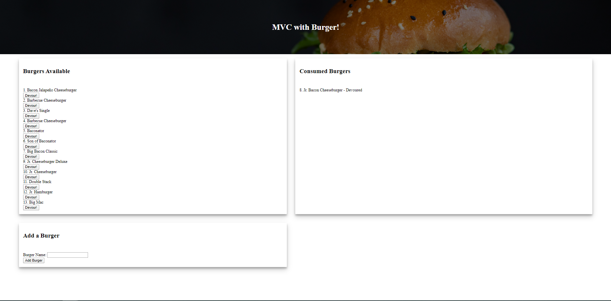

# Burger App with MVC

### Burger application utilizing Handlebars, Express, and MySQL to create or remove burgers created by the user.

## Live Demo

https://dashboard.heroku.com/apps/floating-crag-82018

## Installation

1. Clone the repo to your local machine
2. Run "npm i" in your terminal
3. Change the user information in the connection.js file
4. Run both the SQL files in the DB file in MySQL workbench
5. Run "npm start" to run the application.

## Known Issue / Bugs

* Not applicable

## Dependancies

* Express 4.17.1
* Express-Handlebars 4.0.0
* MySQL 2.18.1
* Nodemon 2.0.3
